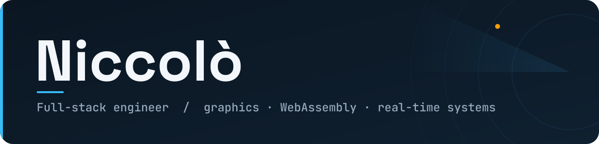

<!-- ============================================================
     PROFILE README  ·  Niccolò
     Palette  →  slate #0B1622 · cyan #38BDF8 · amber #F59E0B
     Replace every  your-username / your-link  placeholder.
     ============================================================ -->

Florence, Tuscany · Italy

 

 

> I build the parts most people call _"not possible in the browser"_ —
> Rust → WASM tooling, WebGPU rendering, and C++ sensor pipelines, wired into production web apps.

---

### What I work on

**Real-time graphics & geospatial.** Three.js + WebGPU naval visualization fed by a C++ radar-spoke backend over WebRTC. DEM tile fetching, PNG decode, bilinear sampling and land/sea elevation merging — done in TypeScript, profiled down to the render loop (IndexedDB cache churn, WebGPU pipeline-compilation stalls).

**WebAssembly tooling.** Browser-side parsers with a Rust/WASM core and a thin TypeScript shell — `wasm-pack` + `wasm-bindgen`, shipped as installable npm packages.

**Production web at scale.** React/TypeScript SPAs on a Node.js backend (Nginx · PM2 · Linux), high-throughput canvas rendering of hundreds of live targets over WebSocket, and data plumbing on PostgreSQL/PostGIS with streaming replication over a private network.

---

### Selected work

**[`@niccolo/idml-parser`](https://www.npmjs.com/package/@niccolo/idml-parser)** — Browser-side Adobe IDML parser & SVG renderer.
Rust/WASM core (`wasm-pack`, `wasm-bindgen`) · TypeScript shell · zero-server, runs entirely client-side.

**Real-time naval visualization** — USV sensor data, rendered live.
Three.js (WebGPU) · Next.js · C++ radar-spoke processing · WebRTC transport.

**AIS vessel tracking** — Hundreds of simultaneous targets, smooth.
Custom Leaflet Canvas layer · WebSocket · SVG ship markers tuned to Marine-Traffic style.

**PDF → editable HTML** — Pixel-perfect, in-browser.
Node.js · MuPDF (WASM) · contenteditable text spans overlaid on rendered pages.

I also maintain GDO / large-scale-retail tooling and distributed retail-data systems (Bun · Hono · PostgreSQL · Redis · Ollama). Most of that is closed-source — happy to talk through it.

---

### Stack

**Languages**

**Graphics & low-level**

**Web**

**Data & infra**

---

### Currently

Pushing a real-time naval-drone visualization system: **Three.js WebGPU + Next.js** on the front, **C++** crunching radar spokes on the back, **WebRTC** moving sensor data in between — and chasing every millisecond out of the render loop.

 

Built in TypeScript, Rust, and C++. Kept simple on purpose.

